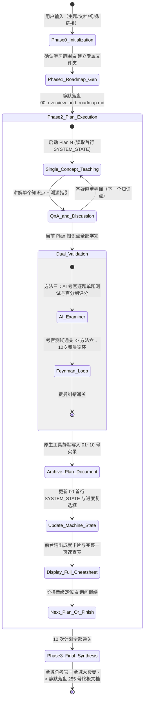

# 🚀 Study via AI (10倍速 AI 辅助自适应学习操作系统)

<p align="center">
  
  
  
  
</p>

> **让 AI 成为你的顶级私教与苏格拉底式引路人。拒绝填鸭与自嗨，以“单点沉浸教学 + 双重内化考核 + 12 份标准化知识资产落盘”，带你 10 倍速彻底吃透任何硬核技能、技术文档或专业教材。**

---

## 🌟 为什么选择 Study via AI？

市面上绝大多数学习类 Prompt / Skill 往往存在三大致命痛点：
1. **填鸭与假懂**：AI 一口气把所有内容全总结出来，看似学了很多，其实是大脑的“认知过载”与“看懂了的假象”。
2. **长上下文状态漂移**：聊到第 3 个小时，AI 注意力涣散，忘记最初的严格规则，开始胡乱跳步。
3. **学完无资产**：关闭对话窗口后，交互过程全部丢失，没有留下可复用、可检索的结构化成果。

**Study via AI 彻底重构了 AI 辅助学习的工作流：**

```
┌────────────────────────────────────────────────────────────────────────┐
│                        Study via AI 核心架构                            │
├────────────────────────────────────────────────────────────────────────┤
│ 1. 输入全自适应     │ 支持 PDF / Word / 视频 / 链接 / 主题任意材料     │
│ 2. 单点沉浸教学     │ 一次对话只讲一个知识点，通俗比喻 + 资料页码精确定位 │
│ 3. 双重内化考核     │ AI 考官单题打分 + 12 岁儿童白话费曼纠错循环       │
│ 4. 外部机器状态头   │ 首行元数据解耦，防上下文注意力漂移，100% 确定性接关 │
│ 5. 12 份标准档案    │ 原生工具静默落盘 00~255 号 Markdown + 一页速查表   │
│ 6. 全局逃生/快进    │ 支持 /skip, /jump (带依赖气囊), /status, /mode    │
└────────────────────────────────────────────────────────────────────────┘
```

---

## 🔄 全流程工作流与状态机



---

## 📁 标准化 12 份 Markdown 资产体系

学完整个课程后，系统将在你的专属学习目录下自动生成 12 份排版严谨、包含 `[TOC]` 大纲树的 Markdown 知识库：

| 文件名 | 内容概述 |
| :--- | :--- |
| `00_overview_and_roadmap.md` | 首行机器状态头 + 5 级学习阶梯 + 20 小时精选计划总览与实时进度清单 |
| `01_plan_01_<topic>.md` | Plan 01 完整真实实录 + 附录：Plan 01 一页速查表 |
| `02_plan_02_<topic>.md` ~ `10_plan_10_<topic>.md` | Plan 02 ~ Plan 10 各阶段学习实录与速查表 |
| `255_final_synthesis_and_cheatsheet.md` | 全域终极大考与费曼实录 + 附录：全域终极大一统速查表 (Master Sheet) |

---

## ⚡ 全局快捷控制指令 (Command Center)

学习过程中随时可以使用以下指令控制节奏：

* `/skip`：跳过当前知识点讲解或考核，快速进入下一环节。
* `/jump <01~10|255>`：直接跳转到指定 Plan。*(自带前序依赖安全气囊，跳级时会提醒确认)*
* `/status`：调出当前学习进度与掌握度阶梯。
* `/cheatsheet [01~10|255]`：调出指定 Plan 或全域终极的一页速查表。
* `/mode <quick|deep>`：切换模式（`quick` 极速突击 / `deep` 深度攻坚）。

---

## 📥 安装与使用指南

### 在 Google Antigravity 中使用（推荐）

#### 方式 1：全局安装（所有项目通用）
将本仓库中的 `Study_via_AI` 文件夹放置到全局配置目录中：
* **Windows**: `C:\Users\<用户名>\.gemini\config\skills\Study_via_AI\`
* **macOS / Linux**: `~/.gemini/config/skills/Study_via_AI/`

#### 方式 2：项目专属安装
将 `Study_via_AI` 文件夹放置到任意项目的 `.agents/skills/Study_via_AI/` 目录下。

---

### 🚀 快速启动

在对话框中直接输入：
```text
使用 Study_via_AI 帮我学习 [主题名称 / 上传教材文档 / 粘贴文章链接]
```

**断点续学（新开会话）**：
```text
继续 [文件夹名称或主题名称] 的学习
```

---

## 📄 开源许可证

本项目采用 [MIT 许可证](LICENSE)。欢迎 Star ⭐️、Fork 并提交 PR！
