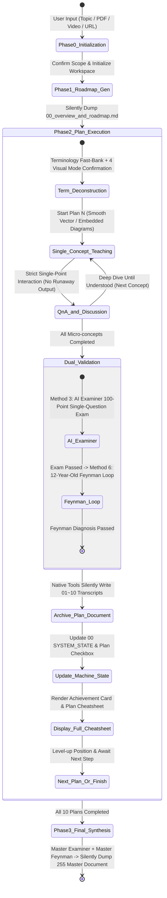

<p align="right">
  <a href="./README.md">中文</a> | <b>English</b>
</p>

<p align="center">
  <h1 align="center">🚀 Study via AI</h1>
  <p align="center"><b>10x Socratic AI Study OS for Agentic Coding & Knowledge Mastery</b></p>
  <p align="center"><i>From Zero to Deep Mastery: Single-concept Immersion + 4 Visual Pedagogy Modes + Dual Inner-Assessment + 12 Structured Markdown Assets Silent Dump</i></p>
</p>

<p align="center">
  <a href="https://github.com/lowellran/Study_via_AI/stargazers"></a>
  <a href="https://github.com/lowellran/Study_via_AI/releases"></a>
  
  
  <a href="./LICENSE"></a>
</p>

---

> 💡 **Say Goodbye to Shallow "Ask AI and Forget Everything When You Close the Window" Learning!**  
> `Study_via_AI` is a self-adaptive learning OS designed for modern Agent environments like **Google Antigravity, Claude Code, OpenAI Codex CLI, Cursor, and Windsurf**. By enforcing **strict state machines, single-concept socratic breakdowns, 4 modern visual pedagogy modes, single-question AI exams, and 12-year-old Feynman diagnosis loops**, it automatically compiles and saves 12 structured Markdown knowledge assets directly to your local workspace.

---

## ⚡ Quick Install

### Method 1: Send Directly in Agent Chat (Zero Setup, Recommended)

Simply copy and send this prompt to **Google Antigravity / Claude Code / Codex / Cursor**:

```text
Install this skill https://github.com/lowellran/Study_via_AI
```
> 💡 *Whenever updates are released, sending the same prompt will automatically upgrade the skill.*

---

### Method 2: One-Liner CLI Installation

#### For Codex CLI:
```bash
# Windows (PowerShell)
git clone https://github.com/lowellran/Study_via_AI.git "$env:USERPROFILE\.codex\skills\Study_via_AI"

# macOS / Linux
git clone https://github.com/lowellran/Study_via_AI.git ~/.codex/skills/Study_via_AI
```

#### For Generic Agent Skills Ecosystem:
```bash
npx skills add lowellran/Study_via_AI -y -g
```

---

## 🎯 Quick Start in 30 Seconds

Once installed, start learning in any chat:
```text
Use Study_via_AI to help me master [Topic Name / Uploaded Textbook PDF / Article URL]
```

**Cross-session Breakpoint Resumption** (Open a new conversation anytime without losing progress):
```text
Continue studying [Folder Name or Topic Name]
```

---

## 🎨 4 Visual Pedagogy & Presentation Modes

Before diving into each micro-concept, the system automatically presents a **Terminology Fast-Memory Bank** and offers 4 visual modes tailored to your preference:

1. 🖼️ **Option 1【AI Deep Diagram Generation】**:
   - **Mode 1A**: Tutor directly generates vibrant mechanism and metaphorical concept diagrams with detailed paragraph breakdowns.
   - **Mode 1B**: Tutor provides dual-prompt sets and **blocks execution**, waiting for the user to generate externally and paste back.
2. ⚡ **Option 2【Fast-Paced Direct Teaching (Modern Smooth Diagrams)】**:
   - Skips image generation waits; uses crisp vector diagrams (SVG/Mermaid), **completely deprecating jagged, primitive ASCII art**.
3. 🌐 **Option 3【Original Materials & Live Network Extraction】**:
   - Calls background Python tools to extract original textbook PDF schematics, video keyframe captures, and scrapes top web tutorial illustrations directly into the transcript.
4. 🌟 **Option 4【Smart Multimodal Mode】(Highly Recommended)**:
   - Integrates the strengths of 1, 2, and 3. Grounded in benchmark pedagogy guides, delivering crystal-clear metaphors alongside seamless, context-embedded vector diagrams and timing charts.

---

## 📊 Paradigm Comparison: Why Choose Study via AI?

| Dimension | Traditional Q&A / Summary Prompts | Generic Roadmap Tools | 🚀 **Study via AI (Learning OS)** |
| :--- | :--- | :--- | :--- |
| **Teaching Granularity** | Dumps long essays at once; high cognitive overload | Generates titles without deep explanations | **Single-Concept Immersion**: Explains 1 concept per dialogue turn, strictly awaiting user input |
| **Visual Presentation** | Rough ASCII text or plain text walls | Missing diagrams or formatting bugs | **Smooth Modern Vectors/Original Schematics**: No ASCII art; 4 visual modes |
| **Source Anchoring** | Generic AI knowledge detached from materials | Surface-level table of contents | **Precise Resource Pointers**: Cites exact chapter, page numbers, and video timestamps |
| **Inner-Assessment** | No tests or shallow questions ("Illusion of competence") | Lists questions with no interactive correction | **Dual Validation Loop**: AI Examiner scoring + 12-year-old Feynman plain-English diagnosis |
| **Anti-Drift & Memory** | Rules and state forgotten in long sessions | No state transition engine | **Decoupled Machine State Header**: Filesystem-persisted state > Context memory |
| **Asset Retention** | Lost immediately when window closes | Scattered, unformatted logs | **12 Standard Markdown Files**: Structured outline trees, raw transcripts & One-Page Cheatsheets |
| **User Control** | Passive execution | Hard to jump or adjust pace | **Full Command Center**: Supports `/skip`, `/jump`, `/status`, `/mode` |

---

## 🔄 Full Workflow & State Machine



---

## 📁 12 Structured Markdown Assets Ecosystem

Upon completing the curriculum, the system compiles 12 professionally formatted Markdown knowledge documents with `[TOC]` outline trees in your learning directory:

```text
📁 Your_Learning_Workspace/
├── 📄 00_overview_and_roadmap.md             # Machine State Header + 5 Ladders + 20-Hour Plan & Overall Progress
├── 📄 01_plan_01_<topic>.md                  # Plan 01 Transcript + Appendix: Plan 01 One-Page Cheatsheet
├── 📄 02_plan_02_<topic>.md                  # Plan 02 Transcript + Appendix: Plan 02 One-Page Cheatsheet
│   ...
├── 📄 10_plan_10_<topic>.md                  # Plan 10 Transcript + Appendix: Plan 10 One-Page Cheatsheet
└── 📄 255_final_synthesis_and_cheatsheet.md  # Master Examiner & Feynman Transcripts + Unified Master Cheatsheet
```

---

## 💻 Compatibility Matrix

| Environment / AI Agent Platform | Compatibility | Highlights & Features |
| :--- | :---: | :--- |
| **Google Antigravity** | 🌟 **Native Support (Recommended)** | Auto Skill recognition, native file read/write, silent 12-document dump |
| **Claude Code** | ✅ **Full Support** | Native file writing, cross-session breakpoint resumption, global & project configs |
| **OpenAI Codex CLI** | ✅ **Full Support** | Native automation workflow execution |
| **Cursor / Windsurf** | ✅ **Full Support** | Usable as Project Rules / Agent Skill configuration |
| **OpenCode / ZCode / OpenClaw** | ✅ **Full Support** | Full state machine and slash commands support |
| **Web UI Chats** | ⚠️ **Manual Copying** | Requires manual copying of generated Markdown due to sandbox constraints |

---

## 📚 Real-World Benchmark Examples

The [`examples/`](./examples/) directory provides authentic, battle-tested learning repositories across three domains:

1. ⚙️ **[GD32F4 Embedded Firmware & Driver Development](./examples/gd32_embedded_development/)**
   - Features: `00` RCU clock tree 5-tier roadmap, `01` industrial C code deep dive, GPIO/RCU examiner logs & cheatsheet.
2. 💬 **[Interpersonal Dynamics & Social Psychology](./examples/pua_dynamics_mastery/)**
   - Features: `00` roadmap, `01` evolutionary psychology dialogue transcripts, dual-value frame analysis & cheatsheet.
3. 🎵 **[Vocal Mechanism & Mixed Voice Mastery](./examples/ktv_vocal_mastery/)**
   - Features: `00` roadmap, `01` diaphragmatic support & vocal fold closure transcripts and cheatsheets.

---

## ⚡ Global Command Center

Control your learning pace anytime using these commands:

* `/skip`: Skip the current concept explanation or test to jump ahead.
* `/jump <01~10|255>`: Jump directly to a target Plan. *(Includes prerequisite airbag warnings)*
* `/status`: Display current progress ladder and mastery level.
* `/cheatsheet [01~10|255]`: Display the target Plan or Master Cheatsheet.
* `/mode <quick|deep>`: Switch pace (`quick` for speedrun / `deep` for deep mastery).

---

## 🤝 Contributing & Support

Issues and Pull Requests are warmly welcome! If this skill empowers your deep learning journey, please give us a ⭐ **Star** on GitHub!

## 📄 License

Distributed under the [MIT License](LICENSE).
