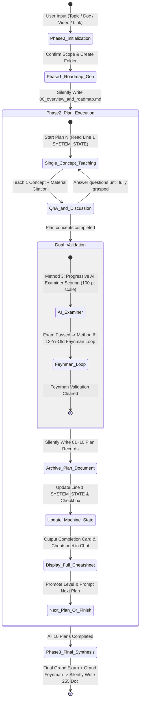

<p align="right">
  <a href="./README.md">中文</a> | <b>English</b>
</p>

# 🚀 Study via AI (10x AI-Powered Adaptive Learning OS)

<p align="center">
  
  
  
  
  
</p>

> **Transform your AI into a master tutor and Socratic mentor. Reject spoon-feeding and the illusion of competence. Powered by single-concept immersion, dual active-recall validation, and automated 12-document structured knowledge archival.**

---

## ⚡ Super Easy Installation & Updates

### Method 1: Natural Language Prompt (Recommended, Zero-Setup)

Simply paste the following command into **Google Antigravity / Claude Code / OpenAI Codex / OpenCode / ZCode / OpenClaw / Reasonix** or any Agent platform supporting GitHub repo/skill imports:

```text
Install this skill https://github.com/lowellran/Study_via_AI
```
> 💡 *To update in the future, simply send the exact same command again.*

---

### Method 2: CLI One-Liner

```bash
# Add globally to your skills registry
npx skills add lowellran/Study_via_AI -y -g
```

---

### Method 3: Manual Installation

1. Clone or download this repository:
   ```bash
   git clone https://github.com/lowellran/Study_via_AI.git
   ```
2. Place the `Study_via_AI` folder into your global skills directory:
   - **Windows**: `C:\Users\<Username>\.gemini\config\skills\Study_via_AI\`
   - **macOS / Linux**: `~/.gemini/config/skills/Study_via_AI/`

---

## 🚀 Quick Start

Once installed, start learning in any chat session:
```text
Use Study_via_AI to help me master [Topic / Upload Textbook PDF / Paste Article Link]
```

**Cross-Session Resumption** (start a new chat anytime):
```text
Continue learning in [Folder Name or Topic]
```

---

## 📊 Paradigm Comparison

| Dimension | Generic Q&A / Summary Prompts | Roadmap Outline Tools | **Study via AI (Learning OS)** |
| :--- | :--- | :--- | :--- |
| **Teaching Granularity** | Dumps long walls of text, causing cognitive overload | Generates titles without deep concept teaching | **Extreme Single-Concept Pacing**: Teaches one point per turn with vivid analogies |
| **Material Grounding** | Relies solely on generic pre-trained knowledge | Superficial text extraction | **Precise Page Sourcing**: Points to exact textbook page numbers & video timestamps |
| **Validation Rigor** | No testing or shallow queries ("Did you get it?") | Static quizzes without interactive error diagnosis | **Dual Active Recall**: AI Examiner progressive scoring + 12-year-old Feynman diagnostic loop |
| **State & Anti-Drift** | Suffers severe attention drift & rule amnesia in 3h+ chats | Stateless | **Decoupled Machine State Header**: External file state > Context memory |
| **Knowledge Assetization**| Ephemeral chat logs lost when closing window | Plain summary notes | **12 Standardized Markdown Archives**: Built-in `[TOC]` outline tree & one-page cheatsheets |
| **User Autonomy** | User is passively dragged through fixed prompts | Rigid execution | **Command Center**: Full control with `/skip`, `/jump`, `/status`, `/mode` |

---

## 💻 Multi-Platform Compatibility Matrix

| Environment / Agent Platform | Compatibility | Features & Capabilities |
| :--- | :---: | :--- |
| **Google Antigravity** | 🌟 **Native (Recommended)** | Auto-skill discovery, silent native file tool write, 12-doc archival |
| **Claude Code** | ✅ **Full Support** | Native file write, cross-session resumption, project/global config |
| **OpenAI Codex CLI** | ✅ **Full Support** | Native task automation and execution |
| **OpenCode / ZCode / OpenClaw** | ✅ **Full Support** | Full state machine & interactive command support |
| **Cursor / Windsurf** | ✅ **Supported** | Configurable via Agent Skills / Rules |
| **Web Chat (Vanilla ChatGPT / Claude)** | ⚠️ **Manual Fallback** | Lacks native filesystem access; markdown must be copied manually |

---

## 📚 Real-World Examples

Explore genuine, authentic learning runs from actual study sessions in the [`examples/`](./examples/) folder:

1. ⚙️ **[GD32F4 Microcontroller & Hardware Driver Development](./examples/gd32_embedded_development/)**
   - Features: `00` RCU Clock Tree 5-level ladder roadmap, `01` Real hardware code breakdown, RCU/GPIO examiner score logs & cheat sheet.
2. 💬 **[Social Dynamics & Relationship Psychology Mastery](./examples/pua_dynamics_mastery/)**
   - Features: `00` Evolutionary psychology & frame control roadmap, `01` Authentic dual-value signifier transcript & cheat sheet.
3. 🎵 **[KTV Pop Vocal Techniques & Resonance](./examples/ktv_vocal_mastery/)**
   - Features: `00` Vocal progression ladder roadmap, `01` Diaphragmatic support & vocal cord closure verbatim transcript & cheat sheet.

---

## 🔄 State Machine & Workflow



---

## 📁 12 Standardized Markdown Knowledge Archives

Upon completing your learning journey, you will find 12 structured, Typora/Markdown-compatible documents in your folder:

| File Name | Content Description |
| :--- | :--- |
| `00_overview_and_roadmap.md` | Line 1 Machine State Header + 5-Level Ladders + 20-Hour Pareto Roadmap & Checklist |
| `01_plan_01_<topic>.md` | Plan 01 Verbatim Dialogue Transcript + Appendix: Plan 01 One-Page Cheatsheet |
| `02_plan_02_<topic>.md` ~ `10_plan_10_<topic>.md` | Plan 02 ~ Plan 10 Stage Transcripts & One-Page Cheatsheets |
| `255_final_synthesis_and_cheatsheet.md` | Master Synthesis Transcripts + Appendix: Ultimate Master Cheatsheet |

---

## ⚡ Command Center

Take control of your learning pace at any time:

* `/skip`: Skip the current concept explanation or quiz and advance immediately.
* `/jump <01~10|255>`: Jump directly to a specific Plan *(includes safety guardrail to warn against skipped prerequisites)*.
* `/status`: Display current progress and mastery level from the machine state header.
* `/cheatsheet [01~10|255]`: Instantly display the one-page cheat sheet for any Plan.
* `/mode <quick|deep>`: Switch between `quick` (concept + 1 quiz) and `deep` (full teaching + dual validation + complete archival).

---

## 📄 License

This project is licensed under the [MIT License](LICENSE). Feel free to submit PRs, open Issues, and enjoy 10x deep learning! ⭐️
