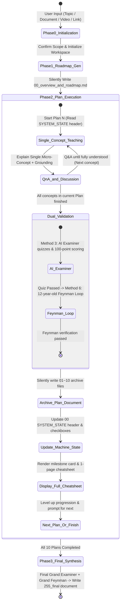

<p align="right">
  <a href="./README.md">中文</a> | <b>English</b>
</p>

<p align="center">
  <h1 align="center">🚀 Study via AI</h1>
  <p align="center"><b>10x Socratic AI Study OS for Agentic Coding & Knowledge Mastery</b></p>
  <p align="center"><i>From Zero to Deep Mastery: Single-concept Immersion + Dual Inner-Assessment + 12 Structured Markdown Assets Silent Dump</i></p>
</p>

<p align="center">
  <a href="https://github.com/lowellran/Study_via_AI/stargazers"></a>
  <a href="https://github.com/lowellran/Study_via_AI/releases"></a>
  
  
  <a href="./LICENSE"></a>
</p>

---

> 💡 **Say Goodbye to Shallow Learning where you chat with AI and forget everything once the tab closes!**  
> `Study_via_AI` is an adaptive study operating system built for modern AI agents including **Google Antigravity, Claude Code, OpenAI Codex CLI, Cursor, and Windsurf**. Rejecting overwhelming spoon-feeding, it uses a **strict state machine, single-concept immersion, an AI examiner with percentage scoring, and a 12-year-old Feynman feedback loop** to automatically generate 12 structured Markdown knowledge base files locally.

---

## ⚡ Super Easy Installation (Quick Install)

### Method 1: Natural Language Prompt (Recommended, Zero Setup)

Simply copy and paste this single prompt into **Google Antigravity / Claude Code / Codex / Cursor**:

```text
Install this skill https://github.com/lowellran/Study_via_AI
```
> 💡 *To update in the future, simply send the exact same command again.*

---

### Method 2: One-Liner CLI

#### For Codex CLI:
```bash
# Windows (PowerShell)
git clone https://github.com/lowellran/Study_via_AI.git "$env:USERPROFILE\.codex\skills\Study_via_AI"

# macOS / Linux
git clone https://github.com/lowellran/Study_via_AI.git ~/.codex/skills/Study_via_AI
```

#### For Generic Agent Skills Registry:
```bash
npx skills add lowellran/Study_via_AI -y -g
```

---

## 🎯 30-Second Quick Start

Once installed, simply send in any conversation:
```text
Use Study_via_AI to help me master [Topic Name / Upload Textbook PDF / Paste Article or Video Link]
```

**Cross-Session Breakpoint Resume** (Start a new conversation anytime without losing progress):
```text
Resume study for [Folder Name or Topic Name]
```

---

## 📊 Why Choose Study via AI? (Paradigm Comparison)

| Core Dimension | Traditional Q&A / Summary Prompts | Pure Outline Tools | 🚀 **Study via AI (Learning OS)** |
| :--- | :--- | :--- | :--- |
| **Teaching Granularity** | Dumps long walls of text; causes cognitive overload | Only generates high-level outlines | **Micro-concept Immersion**: Focuses strictly on 1 concept per turn |
| **Source Material Grounding** | Generic output detached from textbooks | Rough table-of-contents extraction | **Precise Source Grounding**: References exact textbook chapters/pages & video timestamps |
| **Active Recall Depth** | No quizzes or superficial questions; "illusion of competence" | Unchecked practice questions | **Dual-Internalization Loop**: AI examiner percentage scoring + 12-year-old plain English Feynman review |
| **Anti-Drift & Context** | Rules forgotten in long sessions; severe context drift | No state transition mechanics | **Decoupled Machine State**: Disk-persisted state header > Context memory |
| **Asset Archival** | Disappears when closing chat window; zero retention | Fragmented session logs | **12 Structured Markdown Files**: Complete with TOC outline tree, dialogues & 1-page cheatsheets |
| **User Agency** | Passively pushed by rigid AI flows | Hard to adjust pace | **Global Command Center**: Full control with `/skip`, `/jump`, `/status`, `/mode` |

---

## 🔄 Full Workflow & State Machine



---

## 📁 Standard 12-Document Markdown Knowledge Base Architecture

After completing the full study program, 12 beautifully formatted Markdown documents with `[TOC]` navigation are automatically archived in your dedicated study folder:

```text
📁 Your_Study_Workspace/
├── 📄 00_overview_and_roadmap.md             # Machine state header + 5-level ladder + 20h roadmap & progress
├── 📄 01_plan_01_<topic>.md                  # Plan 01 transcript + Appendix: Plan 01 1-Page Cheatsheet
├── 📄 02_plan_02_<topic>.md                  # Plan 02 transcript + Appendix: Plan 02 1-Page Cheatsheet
│   ...
├── 📄 10_plan_10_<topic>.md                  # Plan 10 transcript + Appendix: Plan 10 1-Page Cheatsheet
└── 📄 255_final_synthesis_and_cheatsheet.md  # Final Grand Examiner/Feynman transcript + Master Cheatsheet
```

---

## 💻 Platform Compatibility Matrix

| AI Agent Platform / IDE | Support Level | Supported Features |
| :--- | :---: | :--- |
| **Google Antigravity** | 🌟 **Native (Recommended)** | Auto skill detection, file I/O, silent 12-doc archival |
| **Claude Code** | ✅ **Full Support** | Native file writing, cross-session resume, project/global config |
| **OpenAI Codex CLI** | ✅ **Full Support** | Native execution & automated workflows |
| **Cursor / Windsurf** | ✅ **Full Support** | Import as Project Rules / Agent Skill config |
| **OpenCode / ZCode / OpenClaw** | ✅ **Full Support** | Full state machine & command center support |
| **Web Chat Interfaces** | ⚠️ **Manual Archiving** | Lacks local disk write permissions; user copies output Markdown manually |

---

## 📚 Real-World Battle-Tested Examples

Check out the real learning archives in the [`examples/`](./examples/) folder:

1. ⚙️ **[GD32F4 Embedded Firmware & Hardware Driver Mastery](./examples/gd32_embedded_development/)**
   - Features: `00` RCU clock tree 5-level ladder, `01` real C driver deep-dive, RCU/GPIO examiner scoring transcript & 1-page cheatsheet.
2. 💬 **[Interpersonal Dynamics & Social Game Mastery](./examples/pua_dynamics_mastery/)**
   - Features: `00` progress roadmap, `01` evolutionary psychology & prize framing transcript, dual-value signifiers breakdown & cheatsheet.
3. 🎵 **[Contemporary KTV Pop Vocal & Mixed Voice Mastery](./examples/ktv_vocal_mastery/)**
   - Features: `00` vocal milestone roadmap, `01` diaphragm support & vocal cord closure transcript & cheatsheet.

---

## ⚡ Global Command Center

Control your learning pace anytime with slash commands:

* `/skip`: Skip the current explanation or quiz and advance to the next step.
* `/jump <01~10|255>`: Jump directly to a designated Plan (includes prerequisite safety airbag).
* `/status`: Display current study progress and mastery level.
* `/cheatsheet [01~10|255]`: Display the 1-page cheatsheet for a specific Plan or master sheet.
* `/mode <quick|deep>`: Toggle mode (`quick` sprint / `deep` thorough dive).

---

## 🤝 Contributing & Support

Issues and Pull Requests are warmly welcome! If this skill helps your deep learning workflow, please give it a ⭐ **Star** on GitHub—it means the world to open-source creators!

## 📄 License

This project is licensed under the [MIT License](LICENSE).
