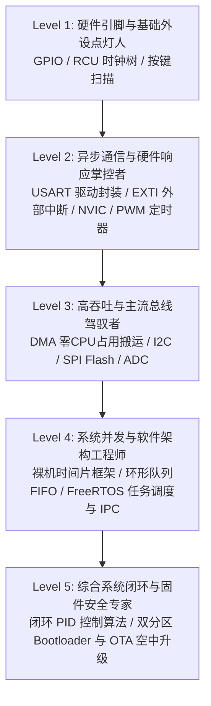

# GD32 (ARM Cortex-M4) 嵌入式全栈开发实战路线图

[TOC]

---

## 模块一：方法五 · 过滤干扰精简资源 (Resource Filter)

在嵌入式开发中，官方文档动辄上千页，网络上的教程鱼龙混杂且充斥大量无意义的机械复制。掌握 GD32 的二八法则在于：**以核心手册为根基，以模块化实战讲义为主线，以标准驱动封装为目标，拒绝在非核心外设与过时配置上浪费时间。**

| 序号 | 资源名称 | 核心定位 | 适合人群 | 怎么高效使用 | 避坑防冗余提示 |
| :--- | :--- | :--- | :--- | :--- | :--- |
| 1 | **用户专属讲义《GD32嵌入式讲义与源码实战手册》** | **主线实战教材** | 零基础~进阶实战 | 紧扣每个 Plan 对应的章节，精读代码实现与电路原理图，动手复现。 | 讲义代码量大（3.3万行），不需要死记硬背每个寄存器位，重点抓外设配置逻辑与初始化流水线。 |
| 2 | **兆易创新官方《GD32F4xx User Manual / Datasheet》** | **官方权威底座** | 全阶段查阅 | 遇到引脚复用（AF）、RCU 时钟树、外设寄存器映射时作为权威字典查阅。 | **严禁从头到尾通读**！仅按外设章节（如 RCU/GPIO/USART/TIMER）按需检索关键寄存器与时钟限制。 |
| 3 | **ARM 官方《Cortex-M4 Generic User Guide》** | **内核底层深度** | Level 2~5 深入进阶 | 重点阅读 NVIC 中断控制、SysTick 定时器、VTOR 向量表重映射与特权级架构。 | 忽略与浮点协处理器深层汇编或特定 DSP 指令集无关的繁复理论，重点看异常处理模型。 |
| 4 | **FreeRTOS 官方《Mastering the FreeRTOS Real Time Kernel》** | **操作系统圣经** | Level 4~5 RTOS 实操 | 研读任务状态机、阻塞机制、IPC（队列/信号量/事件组）内核原理。 | 不要深究所有底层汇编端口代码（port.c），聚焦 API 语义、临界区与内存堆算法配置。 |
| 5 | **正点原子 / 野火《ARM32 硬件原理图与电路设计图纸》** | **硬件电路与排障** | 全阶段硬件对照 | 对照开发板原理图，分析按键（上拉/下拉）、LED（灌电流/拉电流）、I2C上拉、SPI CS片选。 | 硬件电路只看核心总线走线与电平特性，不要纠结非核心外设芯片的内部物理封装细节。 |

---

## 模块二：方法一 · 制定 5 级学习阶梯 (Learning Ladders)



### Level 1：硬件引脚与基础外设点灯人 (GPIO / RCU 时钟 / 按键)
- **核心掌握**：
  1. GPIO 的 4 种输入模式（浮空/上拉/下拉/模拟）与 4 种输出模式（推挽/开漏/复用推挽/复用开漏）；
  2. RCU（Reset and Clock Unit）外设时钟使能机制与系统时钟树分频原理；
  3. 轮询式按键消抖算法与 LED 驱动（高低电平有效性与原理图分析）。
- **易错红区 (Pitfalls)**：
  - 配置 GPIO 寄存器前漏开 RCU 外设时钟，导致所有配置完全无效；
  - 按键输入引脚配置为浮空，因悬空电平干扰导致按键误触发；
  - 混淆推挽输出（强高强低）与开漏输出（需外部上拉才能输出高电平）。
- **晋级标准**：能独立看懂按键与 LED 电路图，熟练写出规范的 GPIO 初始化代码，完成稳定无抖动的按键控制逻辑。

### Level 2：异步通信与硬件响应掌控者 (USART / EXTI / NVIC / PWM)
- **核心掌握**：
  1. USART 异步串行通信协议帧结构（波特率/起始位/数据位/停止位/校验位）与 printf 重定向；
  2. NVIC 嵌套向量中断控制器、抢占优先级 (Preemption Priority) 与响应优先级 (SubPriority) 分组机制；
  3. EXTI 外部中断线路映射与边沿触发模式；
  4. 基本/通用定时器工作原理、计数器 (CNT)、预分频器 (PSC)、自动重载值 (ARR) 与 PWM 占空比计算。
- **易错红区 (Pitfalls)**：
  - 在中断服务函数（ISR）中加入 `delay` 延时或超长耗时操作，导致系统响应严重卡顿甚至死锁；
  - 中断服务函数中未清除中断标志位，导致程序死循环在中断中无法退出；
  - PWM 频率与占空比公式推导错误，导致蜂鸣器音调失真或舵机发热抖动。
- **晋级标准**：能封装标准的串口收发库与 printf 调试工具，能运用 EXTI 中断响应外部突发事件，能通过 PWM 精确控制舵机角度与电机转速。

### Level 3：高吞吐与主流总线驾驭者 (DMA / I2C / SPI / ADC)
- **核心掌握**：
  1. DMA（Direct Memory Access）通道分配、M2M / M2P / P2M 传输模式与 USART+DMA+空闲中断机制；
  2. I2C 总线时序协议（起始/停止/ACK/NACK/地址寻址），包括软件 GPIO 模拟与硬件 I2C 驱动 OLED；
  3. SPI 同步总线 4 种极性相位模式（CPOL/CPHA），W25Qxx SPI Flash 扇区擦除与分页写入机制；
  4. 逐次逼近型 ADC 原理、采样通道校准、多通道电压采集与转换公式。
- **易错红区 (Pitfalls)**：
  - DMA 传输未结束即修改源内存数据缓冲区，导致传输数据错乱；
  - I2C 总线 SDA/SCL 引脚未加上拉电阻，或软时序延时不精准导致从机 ACK 丢失；
  - SPI Flash 在未执行扇区擦除（全部为 0xFF）的情况下直接写入数据，导致写操作失败。
- **晋级标准**：能使用 DMA 完成大数据量零 CPU 搬运，独立编写基于 I2C 的屏幕驱动与基于 SPI 的存储器读写驱动，完成 ADC 模拟电压精确测量。

### Level 4：系统并发与软件架构工程师 (裸机时间片框架 / 环形队列 / FreeRTOS)
- **核心掌握**：
  1. 裸机时间片轮询多任务调度器设计（非阻塞编程思维与状态机模型）；
  2. 环形缓冲区（Ring Buffer / 循环队列）FIFO 原理与多字节自定义数据包解包状态机；
  3. FreeRTOS 任务创建、挂起、恢复与抢占式任务调度机制；
  4. FreeRTOS 核心通信与同步组件：二值/计数信号量、互斥量（Mutex 优先级继承）、消息队列与事件标志组。
- **易错红区 (Pitfalls)**：
  - 在 FreeRTOS 中断中直接调用非 `FromISR` 版本的 API，导致内核崩溃；
  - 任务分配的栈空间过小触发 `Stack Overflow` 内存溢出；
  - 共享资源未加互斥锁导致数据竞争，或信号量死锁与优先级反转。
- **晋级标准**：能脱离死等延时构建高效裸机多任务系统，或在 FreeRTOS 下构建 3 个以上互相协同、安全传递消息的实时并发系统。

### Level 5：综合系统闭环与固件安全专家 (PID 算法 / OTA 空中升级)
- **核心掌握**：
  1. PID 控制算法（比例 P、积分 I、微分 D）物理意义、位置式与增量式 PID 代码实现与调参技巧；
  2. 激光测距传感器 (VL53L0X) 闭环控制舵机平衡小球系统；
  3. Bootloader 架构设计、Flash 存储空间分区（Boot/App/Download/Param）、中断向量表重映射 (VTOR)；
  4. 串口与 WiFi OTA 固件接收、分包校验（CRC/MD5）、Flash 烧录与安全双分区回滚机制。
- **易错红区 (Pitfalls)**：
  - Bootloader 跳转到 App 前未关闭全局中断与外设时钟，导致 App 初始化时被悬挂中断异常击溃；
  - App 程序未在 `system_gd32f4xx.c` 中修改 `VECT_TAB_OFFSET`，导致中断触发时跳转到 Bootloader 向量表引发 HardFault；
  - OTA 缺少数据完整性校验，断电或误刷损坏固件导致设备彻底变砖。
- **晋级标准**：能独立设计安全稳定的双分区 Bootloader OTA 升级系统，并能调试出参数收敛、响应快速的 PID 闭环运动控制系统。

---

## 模块三：方法二 · 20小时抓核心（10次学习计划，每次2小时）(20-Hour Pareto Plan)

```
[Plan 01] GPIO与时钟底座 ──> [Plan 02] 串口与驱动封装 ──> [Plan 03] 中断与优先级仲裁 ──> [Plan 04] 定时器与PWM控制 ──> [Plan 05] DMA零占用搬运
                                                                                                                   │
[Plan 10] PID闭环与OTA升级 <── [Plan 09] FreeRTOS实时多任务 <── [Plan 08] 裸机架构与环形队列 <── [Plan 07] SPI总线与Flash <── [Plan 06] I2C总线与驱动
```

| 计划编号 | 学习主题 (2h/次) | 核心知识模块 | 实战落地任务 | 复盘自测与验收标准 |
| :--- | :--- | :--- | :--- | :--- |
| **Plan 01** | **GPIO 硬件底座与 RCU 时钟总线机制** | GPIO 8种工作模式深度解析、RCU 树形时钟架构、引脚电平操作、按键电路上下拉与硬件消抖 | 编写按键控制 LED 翻转程序，分析电路图上拉/下拉配置 | 1. 能说出推挽与开漏的本质差异；<br/>2. 能排查“漏开 RCU 时钟”引发的硬件故障。 |
| **Plan 02** | **USART 串口通信与标准化驱动封装** | 异步串行时序（波特率/帧格式）、USART 发送/接收寄存器、`fputc` 重定向与标准驱动库分层封装 | 封装 `usart_send_string` 与 `printf` 串口调试工具，编写交互式指令回显 | 1. 理解波特率与系统时钟分频关系；<br/>2. 掌握查询方式与状态标志清零。 |
| **Plan 03** | **EXTI 外部中断与 NVIC 中断优先级仲裁** | Cortex-M4 中断向量表、EXTI 触发线路、NVIC 抢占/响应优先级分组、ISR 编写规范 | 实现外部按键 EXTI 下降沿中断翻转 LED，编写带优先级的嵌套中断实验 | 1. 能清楚说明中断抢占与响应的仲裁规则；<br/>2. 掌握 ISR 的 3 大安全规范。 |
| **Plan 04** | **定时器系统 (TIM) 与 PWM 波形生成控制** | 定时器计数原理、PSC 与 ARR 计算、PWM 频率与占空比公式、通道比较输出模式 | 使用通用定时器产生 1kHz/2kHz PWM 驱动蜂鸣器，产生 50Hz PWM 控制 180° 舵机 | 1. 精确计算任意频率与占空比的 PSC/ARR；<br/>2. 掌握舵机 0.5ms~2.5ms 高电平控制原理。 |
| **Plan 05** | **DMA 零 CPU 占用高速数据搬运** | DMA 控制器架构、M2M/M2P/P2M 传输通道、循环缓冲、USART+DMA+IDLE 不定长接收 | 实现 DMA 内存到外设高速发送大数组，以及 USART 空闲中断不定长高效数据帧接收 | 1. 理解 DMA 与 CPU 总线仲裁；<br/>2. 掌握 IDLE 空闲中断判定一帧数据接收完成的机制。 |
| **Plan 06** | **I2C 通信协议（软模拟 vs 硬件）与传感器驱动** | I2C 起始/停止/ACK/寻址时序规范、GPIO 模拟 I2C 时序、硬件 I2C 状态机、OLED 屏幕驱动 | 编写 GPIO 模拟 I2C 驱动，在 0.96寸 I2C OLED 屏幕上显示字符与图形 | 1. 理解 I2C 开漏上拉与双向通信原理；<br/>2. 掌握软模拟 I2C 的时序延时调校。 |
| **Plan 07** | **SPI 通信总线与 SPI Flash 存储驱动** | SPI 4 种工作模式（CPOL/CPHA）、全双工同步时序、W25Qxx Flash 扇区擦除与页写入 | 编写 SPI 驱动读取 W25Qxx 设备 ID，实现扇区擦除、页写入与任意长度数据读出 | 1. 理解 Flash“写前必须擦除”、“只能把1写成0”的物理特性；<br/>2. 掌握 SPI 四种模式的区别。 |
| **Plan 08** | **裸机多任务架构：时间片轮询 + 环形队列 + 自定义协议** | 前后台架构痛点、SysTick 时间片多任务调度器、环形缓冲区 FIFO、自定义数据包解包状态机 | 构建轻量级无操作系统多任务调度框架，集成环形队列解析带校验的串口控制指令 | 1. 掌握循环队列头尾指针判定满/空算法；<br/>2. 掌握非阻塞状态机设计思想。 |
| **Plan 09** | **FreeRTOS 实时多任务协作与 IPC 机制** | RTOS 抢占式调度、任务状态机、FreeRTOSConfig 核心配置、信号量、互斥锁、消息队列与事件组 | 创建 3 个协作任务（传感器采集、业务处理、LED指示），通过队列传参，互斥锁保护串口 | 1. 理解优先级翻转及互斥锁解决方案；<br/>2. 熟记中断中调用 `FromISR` API 的规则。 |
| **Plan 10** | **综合闭环与进阶实战：PID 算法控制与 OTA 升级** | 位置式/增量式 PID 控制算法与调参口诀、Bootloader 架构、Flash 分区、VTOR 重映射、固件校验 | 编写 PID 算法驱动舵机稳定平衡小球；设计串口/WiFi OTA 固件升级管线 | 1. 掌握 Bootloader 跳转 App 的 5 个前置步骤；<br/>2. 掌握 PID 三个参数对系统响应的影响。 |

---

## 模块四：全套 12 份学习档案落盘清单

| 序号 | 档案文件名 | 内容简介 | 状态 |
| :--- | :--- | :--- | :--- |
| 1 | `00_overview_and_roadmap.md` | 全局学习总览、资源过滤、5级学习阶梯、20小时二八定律 10 次计划总览 | **已生成** |
| 2 | `01_plan_01_gpio_and_rcu.md` | Plan 01 完整对话记录大纲 + 附录：Plan 01 一页速查表 | 待学习 |
| 3 | `02_plan_02_usart_driver.md` | Plan 02 完整对话记录大纲 + 附录：Plan 02 一页速查表 | 待学习 |
| 4 | `03_plan_03_exti_and_nvic.md` | Plan 03 完整对话记录大纲 + 附录：Plan 03 一页速查表 | 待学习 |
| 5 | `04_plan_04_timer_and_pwm.md` | Plan 04 完整对话记录大纲 + 附录：Plan 04 一页速查表 | 待学习 |
| 6 | `05_plan_05_dma_transfer.md` | Plan 05 完整对话记录大纲 + 附录：Plan 05 一页速查表 | 待学习 |
| 7 | `06_plan_06_i2c_and_oled.md` | Plan 06 完整对话记录大纲 + 附录：Plan 06 一页速查表 | 待学习 |
| 8 | `07_plan_07_spi_and_flash.md` | Plan 07 完整对话记录大纲 + 附录：Plan 07 一页速查表 | 待学习 |
| 9 | `08_plan_08_baremetal_multitask.md`| Plan 08 完整对话记录大纲 + 附录：Plan 08 一页速查表 | 待学习 |
| 10 | `09_plan_09_freertos_concurrency.md`| Plan 09 完整对话记录大纲 + 附录：Plan 09 一页速查表 | 待学习 |
| 11 | `10_plan_10_pid_and_ota.md` | Plan 10 完整对话记录大纲 + 附录：Plan 10 一页速查表 | 待学习 |
| 12 | `255_final_synthesis_and_cheatsheet.md` | 全域终极考核与费曼实录 + 附录：全域大一统终极一页速查表 | 待通关 |
