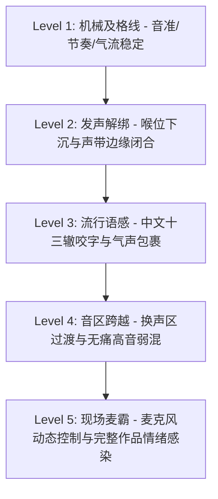

# KTV流行中文歌麦霸速成体系：总览与路线图 (Overview & Roadmap)

[TOC]

---

## 模块一：方法五 · 过滤干扰精简资源 (Resource Filter)

在流行声乐学习中，90% 的自学者被冗长抽象的美声术语（如“面罩共鸣”、“头腔开大洞”）或者繁琐的学院派练声曲劝退。要达成 **KTV 麦霸** 水平，必须以 **极高 ROI（投入产出比）、肌肉本体感受、实战录音反馈** 为核心。以下是严选的 5 大极简核心实操资源：

| 序号 | 核心资源 / 工具 | 适用人群与定位 | 核心用法（怎么用最省时间） | 避坑提醒（不要在哪些地方浪费时间） |
| :--- | :--- | :--- | :--- | :--- |
| 1 | **《全民K歌 / 唱吧》伴奏与实时音高线系统** | 音准与节奏纠偏必备 | 开启“打分/单句重录/音高线”模式。戴单耳耳机录音，肉眼对照音准线偏差，反复修正走音和抢拍。 | 严禁盲目开满电音/混响自我陶醉；练声和纠错必须用“原声音效”听清干声破绽。 |
| 2 | **SLS（Speech Level Singing）经典核心练声动作集** | 声带闭合与换声区打通 | 仅保留 4 个核心动素：**唇颤音（Lip Trill）、NG音、Mum（低喉位）、Gee（头声高位置）**，每次练歌前做 5 分钟热身。 | 不要花几小时去练全套 20+ 个变体音阶；KTV 只需掌握“说话般自然发声”的声带闭合感。 |
| 3 | **流行歌“邪修”本体动作库（筷子/深蹲/气泡音/鸭叫）** | 迅速建立正确肌肉记忆 | 用“咬筷子”强制瘫痪下巴咬肌；用“深蹲/平板支撑”强制激发腹内压对抗喉咙发力；用“扁鸭叫”瞬间找到咽音通道。 | 邪修是“体感触发器”，找到发力感觉后即可脱离动作，不可在唱歌时过度僵硬用力。 |
| 4 | **华语流行歌“十三辙”中文咬字与归韵法则** | 解决唱歌“像念经、土气、字包不住气” | 拆解汉字音节结构：**字头（出字要轻快）、字腹（立字要圆润）、字尾（归韵要收干净）**。掌握流行气声入字技巧。 | 不要用美声字正腔圆的大共鸣咬字，流行歌讲究“说话感、气声包裹、微弱连音”。 |
| 5 | **KTV 声学设备与麦克风实战调控秘籍** | 现场听感立提 30 分的物理外挂 | 掌握动圈麦的**距离动态控制**（弱音贴近吃低频，高音拉开防爆音），学会调节 KTV 混响（Reverb）与伴奏音量比例。 | 不要迷信“原调才是牛”，麦霸的核心是“找到自己的黄金舒适音区，善用伴奏降调”。 |

---

## 模块二：方法一 · 制定 5 级进阶学习阶梯 (Learning Ladders)



### Level 1：机械及格线（音准稳定性与气流平稳）
- **核心掌握知识**：
  1. 腹式横膈膜呼吸法（深吸气腹背膨胀，均匀呼气气流稳定）；
  2. 基础音高对齐能力（用单耳监听法校准全民K歌音高线，杜绝“全篇跑调/走音”）；
  3. 流行拍点切分（进唱点准确，不抢拍、不拖拍）。
- **常见易错红区**：
  - 耸肩胸式呼吸（气浅且顶住脖子）；
  - 全程戴双耳封闭耳机，听不到自己的干声音准；
  - 进歌点模糊，跟着原唱能唱，关掉原唱不会进拍。
- **晋级标准**：
  - 全民K歌自选 1 首慢歌（如毛不易《消愁》或陈奕迅《十年》），干声录音无原唱辅助下，整曲音准得分达到 A 级以上，无明显走音。

### Level 2：发声解绑（解除脖子代偿与声带健康闭合）
- **核心掌握知识**：
  1. 喉头稳定机制（叹气低喉位，杜绝唱高一点就喉头飞起卡死脖子）；
  2. 声带健康闭合（从气泡音到实声，告别“虚弱漏气”或“声带猛烈砸击”）；
  3. 邪修体感激活（咬筷子解放咬肌、深蹲触发腹内压）。
- **常见易错红区**：
  - 下巴向前探、咬肌与脖子两侧青筋暴起硬顶高音；
  - 盲目大声喊叫导致嗓子干哑、发炎；
  - 误以为声带闭合就是拼命用力卡住喉咙。
- **晋级标准**：
  - 连续弹唇音（Lip Trill）轻松滑行一个八度不中断；
  - 咬筷发声或深蹲发声时，脖子完全松弛，能自如发出结实且不刺耳的声音。

### Level 3：流行语感（中文流行咬字与气声情感）
- **核心掌握知识**：
  1. 中文流行咬字“出字-立字-归韵”（窄母音宽唱、宽母音窄唱）；
  2. 气声包裹入字技巧（弱起叹气入音，制造“耳边诉说感”）；
  3. 音色层次对比（主歌轻诉、副歌推力量）。
- **常见易错红区**：
  - 像念课文一样咬字死板，或者大舌头吐字不清；
  - 字尾拖沓不收，所有字都在同一个音量和音色上“平铺直叙”。
- **晋级标准**：
  - 录制一段主歌（如李荣浩《李白》或薛之谦《演员》主歌段），展现出明显的诉说感与气声包裹，不再平淡如念经。

### Level 4：音区跨越（换声区打通与弱混无痛高音）
- **核心掌握知识**：
  1. 换声点（Passaggio）无缝过渡（告别真声撕裂和假声断层）；
  2. 咽音聚焦与头声引入（Goo/Gee、小鸭叫体感，将声音点挂在后咽壁与软腭）；
  3. 弱混声（Light Mix）及假音切换，轻松搞定 A4/B4 流行高音。
- **常见易错红区**：
  - 到了中高音区就习惯性用纯真声“硬拉硬顶”；
  - 一换假声就完全漏气、音量骤降失真。
- **晋级标准**：
  - 能够顺畅从中央 C（C4）平滑滑行到 G4/A4 无明显破音与音量坍塌；能完成《晴天》副歌或《安静》副歌的高音段落。

### Level 5：现场麦霸（声学控场与完整歌曲演绎）
- **核心掌握知识**：
  1. 动圈话筒“距离-角度”物理控音（弱音贴嘴吃低频，副歌大声拉开 5-10cm 防爆破）；
  2. KTV 现场混响（Reverb）与伴奏 EQ 调节，因地制宜美化音色；
  3. 黄金选歌库与降调策略（打造 3-5 首个人招牌屠榜曲目）。
- **常见易错红区**：
  - 麦克风包着网头拿（改变频响导致声音发闷甚至啸叫）；
  - 盲目挑战超出自身音域的歌曲导致现场车祸。
- **晋级标准**：
  - 在 KTV 或全民K歌伴奏下，能够独立、完整、有情感起伏、声压稳定地演绎 3 首不同风格的中文流行代表作，获得现场/听众一致好评。

---

## 模块三：方法二 · 20 小时抓核心（10 次精选学习计划）

每次计划按 2 小时标准设计，涵盖**核心动作机制、邪修/正修体感对抗、全民K歌实战录音、双重内化考核**：

```mermaid
gantt
    title KTV 麦霸速成 10 次计划推进表 (20 Hours)
    dateFormat  X
    axisFormat  Plan %d
    section 基础动力与发声解绑
    Plan 01: 气息发动机与腹压对抗 (深蹲/叹气) : 0, 1
    Plan 02: 声带闭合与无痛发声 (气泡音/NG) : 1, 2
    Plan 03: 喉位下沉与咬肌脱力 (咬筷/傻子笑) : 2, 3
    section 语感与音准校准
    Plan 04: 中文咬字归韵与气声包裹 (十三辙) : 3, 4
    Plan 05: 咽音聚焦与音色穿透力 (鸭叫/内腔聚音) : 4, 5
    Plan 06: 音准线精准狙击与律动切分 (K歌实测) : 5, 6
    section 高音跨越与综合掌控
    Plan 07: 换声区连接与高音弱混 (Gee/头声) : 6, 7
    Plan 08: 流行装饰音 (颤音/哭腔/怒音点缀) : 7, 8
    Plan 09: KTV麦克风物理声学与选歌降调外挂 : 8, 9
    Plan 10: 麦霸曲库 3 首全曲大考与现场通关 : 9, 10
```

| 计划编号 | 计划主题 | 核心实战内容与邪修/正修体感 | 全民K歌 / 录音实战作业 | 考核与过关标准 |
| :--- | :--- | :--- | :--- | :--- |
| **Plan 01** | 气息发动机与腹内压对抗 | 腹式吸气（闻花香/打哈欠）、深蹲/平板支撑静力对抗（强制腹部发力，脖子完全脱力）、吹唇音平稳维持 15s | 录制 15 秒平稳无抖动的弹唇音（Lip Trill）干声 | 能够清晰感知腹背支撑，发声时脖子两侧肌肉完全松软无紧绷 |
| **Plan 02** | 声带边缘闭合与无痛出声 | 气泡音滑入实声、NG 音（后舌根贴软腭）寻找声带边缘振动、消除漏气与大声喊叫 | 录制“气泡音 -> 纯净单音 A -> 气泡音”平滑过渡音频 | 声音结实集中、无漏气风声、喉咙无干燥刺痛感 |
| **Plan 03** | 喉头稳定与咬肌下巴解放 | 邪修“咬筷子”发声（阻断下巴下压）、“傻子憨笑/大叹气”稳定低喉位、软腭抬起与打哈欠半状态 | 录制咬筷子唱歌词与脱离筷子唱相同句子的对比音频 | 下巴不往前探、高音喉头不上窜，声音具有空间感 |
| **Plan 04** | 中文流行咬字十三辙与气声 | 汉字字头喷口、字腹拉长、字尾归韵收声；流行“气包裹字”诉说感入门（主歌抓人利器） | 录制《李白》或《演员》前两句主歌（重点抓咬字与气声诉说） | 告别机械读字，具有明显的华语流行歌叙事感与磁性气声 |
| **Plan 05** | 咽音聚焦与音色穿透力 | 邪修“不张嘴内腔聚焦发声”、“小鸭子叫/小巫婆笑”激发出小共鸣点，小音量产生大穿透力 | 录制带有明亮“金属芯”的穿透力单音片段 | 声音不再发散发虚，在伴奏中能清晰“破开伴奏”突出人声 |
| **Plan 06** | 音准线精准狙击与流行律动 | 全民K歌单耳监听实战、绿线校准、半音音阶微调；身体律动带动进拍与切分重音 | 在全民K歌无原唱伴奏下录制慢歌单段，音准线命中率 > 85% | 纠正“跑调、慢半拍、快半拍”，建立肌肉音准直觉 |
| **Plan 07** | 换声区连接与高音弱混 | 解决 F4/G4 破音与吼叫难题；Mum/Gee 引导头声介入，建立弱混（Light Mix）跨越真假声断层 | 录制由低到高的八度滑音音频（跨越换声区不破音） | 从真声到假声平滑过渡无断层，高音轻松不费力 |
| **Plan 08** | 流行装饰音与情绪爆发点 | 叹气声入音、微哭腔挂点、气震音/自然颤音初探、副歌情绪爆发强声推进 | 录制包含气声主歌与情绪饱满副歌的一段完整副歌段落 | 声音有明显的强弱动态对比（Dynamic Range），富有感染力 |
| **Plan 09** | KTV 麦克风物理外挂与选歌 | 动圈麦距离动态法则（近吃低音，远防破音）、KTV 效果器混响参数、降调（-1 到 -3）定舒适音区 | 模拟麦克风距离录制一段动态测试（弱句近、强句远） | 掌握物理防爆音与音色美化技巧，敲定个人 3 首本命歌单 |
| **Plan 10** | 麦霸曲库 3 首全曲大通关 | 3 首华语流行不同难度曲目（如：叙事抒情/律动中板/高音爆发）全曲录音打磨与结课总评 | 提交 3 首完整录音干声/K歌作品，完成全流程检验 | 达成音准稳、字韵清、高音顺、情绪足的 KTV 麦霸水准 |

---

## 阶段执行说明

- **教学互动方式**：每一 Plan 按极小颗粒度逐个击破，一次对话只讲一个核心动素或实操技巧；
- **练习反馈闭环**：每讲完一个知识点，您随时可以用文字描述体感，或直接录制音频片段/全民K歌得分数据发给我诊断；
- **归档沉淀**：每次 Plan 完成后，将完整对话、录音诊断实录与《一页速查表》自动沉淀为独立 Markdown 档案。
